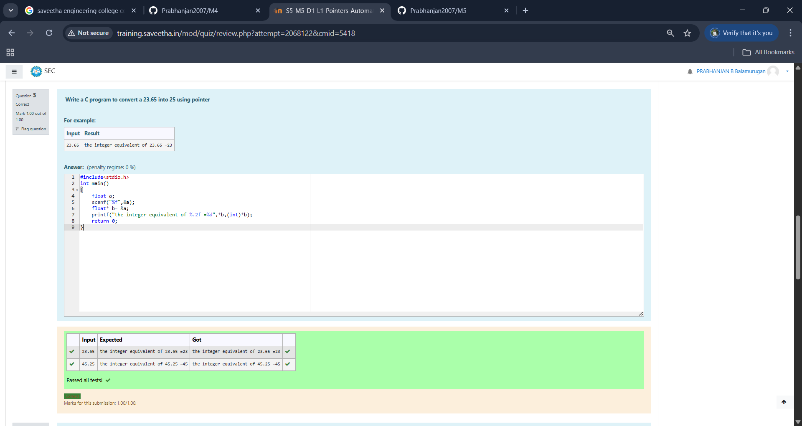
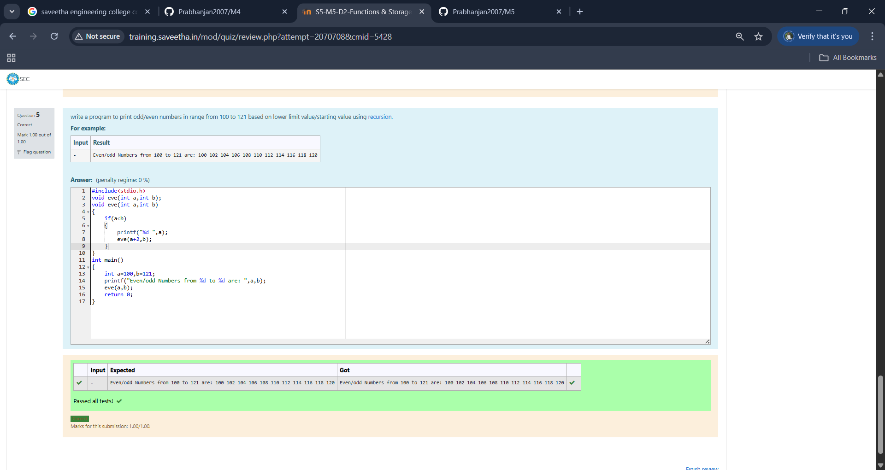
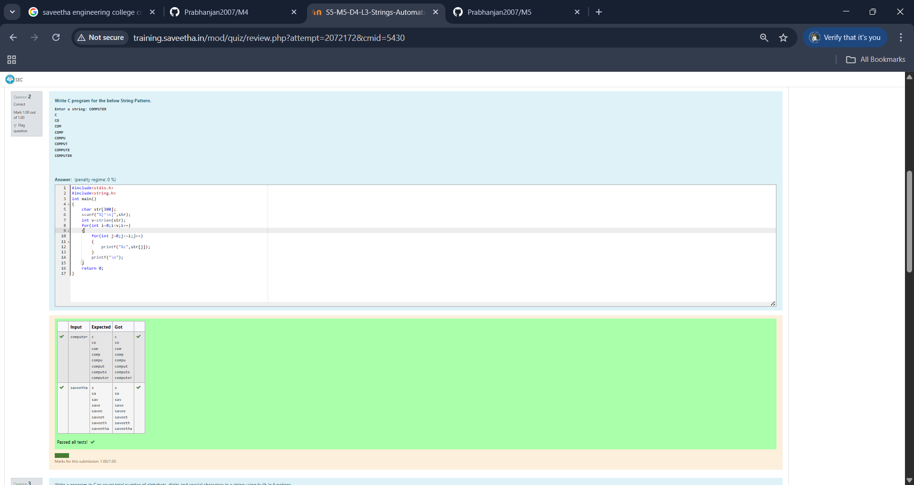
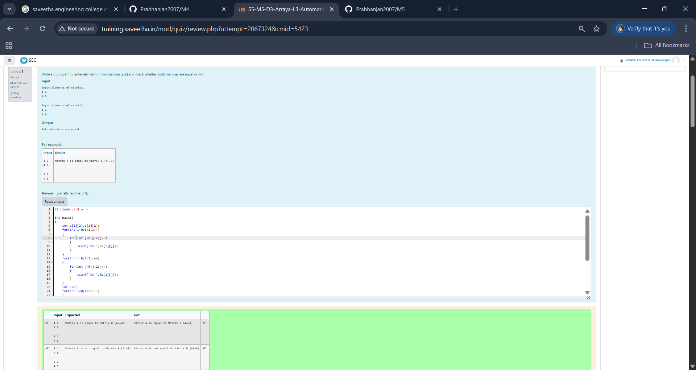

EX-21-POINTERS
# AIM:
Write a C program to convert a 23.65 into 25 using pointer

## ALGORITHM:
1.	Declare a double variable to hold the floating-point number (23.65).
2.	Declare a pointer to double to point to the address of the variable.
3.	Use the pointer to modify the value to 25.0.
4.	Print the modified value.

## PROGRAM:
```
#include<stdio.h>
int main()
{
    float a;
    scanf("%f",&a);
    float* b= &a;
    printf("the integer equivalent of %.2f =%d",*b,(int)*b);
    return 0;
}
```

## OUTPUT:
 	



## RESULT:
Thus the program to convert a 23.65 into 25 using pointer has been executed successfully.
 
 


# EX-22-FUNCTIONS AND STORAGE CLASS

## AIM:

write a program to print odd/even numbers in range from 100 to 121 based on lower limit value/starting value using recursion.

## ALGORITHM:

1.  get two input  from the user and pass it to the function.
2.  In the function if a>b print a and call the fucntion again increaseing the first argument by 2.
3. End program. 

## PROGRAM:
```
#include<stdio.h>
void eve(int a,int b);
void eve(int a,int b)
{
    if(a<b)
    {
        printf("%d ",a);
        eve(a+2,b);
    }
}
int main()
{
    int a=100,b=121;
    printf("Even/odd Numbers from %d to %d are: ",a,b);
    eve(a,b);
    return 0;
}
```
## OUTPUT:



## RESULT:

Thus the program has been executed successfully.
 
 


# EX-23-ARRAYS AND ITS OPERATIONS

## AIM:

Write C Program to find Sum of each row of a Matrix

## ALGORITHM:

1.	Declare and initialize the matrix with the desired values.
2.	Create a loop to iterate through each row of the matrix.
3.	Inside the loop, calculate the sum of the elements in each row.
4.	Print the sum for each row.

## PROGRAM:
```
#include <stdio.h>

int main()
{
    int a,b;
    scanf("%d %d",&a,&b);
    int arr[a][b];
    for(int i=0;i<a;i++)
    {
        for(int j=0;j<b;j++)
        {
            scanf("%d ",&arr[i][j]);
        }
    }
    for(int i=0;i<a;i++)
    {
        int count=0;
        for(int j=0;j<b;j++)
        {
            count+=arr[i][j];
        }
        printf("The Sum of Elements of a Rows in a Matrix:  %d\n",count);
    }
    return 0;
}

```

## OUTPUT


 
 

 ## RESULT
 Thus program executed successfully.


# EX-24-STRINGS

## AIM:

Write C program for the below pyramid string pattern. Enter a string: COMPUTER 
C
CO
COM
COMP
COMPU
COMPUT
COMPUTE
COMPUTER


## ALGORITHM:

1.	Input the number of rows for the pyramid (e.g., num_rows).
2.	Initialize variables:i for the row count (starting from 1),j for the character count (starting from 1)
3.	Start a loop for i from 1 to num_rows (for each row of the pyramid).
4.	Calculate the midpoint position as midpoint = (2 * num_rows - 1) / 2.
5.	End the program.

## PROGRAM:
```
#include<stdio.h>
#include<string.h>
int main()
{
    char str[300];
    scanf("%[^\n]",str);
    int v=strlen(str);
    for(int i=0;i<v;i++)
    {
        for(int j=0;j<=i;j++)
        {
            printf("%c",str[j]);
        }
        printf("\n");
    }
    return 0;
}
```
 ## OUTPUT

 

## RESULT

Thus the C program to String process executed successfully
 

 
.


# EX -25 –DISPLAYING ARRAYS USING POINTERS
## AIM

Write a C program to enter elements in two matrices[2x2] and check whether both matrices are equal or not.

## ALGORITHM
1.  Start program.
2.  Using for loop get the elements for both arrays..
3.  Use another for loop to check the equality of corresponding element.
4.  If everything is true print equal else not equal.
5.  Stop Program

## PROGRAM
```
#include <stdio.h>

int main()
{
    int a[2][2],b[2][2];
    for(int i=0;i<2;i++)
    {
        for(int j=0;j<2;j++)
        {
            scanf("%d ",&a[i][j]);
        }
    }
    for(int i=0;i<2;i++)
    {
        for(int j=0;j<2;j++)
        {
            scanf("%d ",&b[i][j]);
        }
    }
    int C=0;
    for(int i=0;i<2;i++)
    {
        for(int j=0;j<2;j++)
        {
            if(a[i][j]==b[i][j])
            C++;
        }
    }
    if(C==4)
    printf("Matrix A is equal to Matrix B (A==B)");
    else
    printf("Matrix A is not equal to Matrix B (A!=B)");
    return 0;
}

```
## OUTPUT

 

## RESULT

Thus the C program to enter elements in two matrices[2x2] and check whether both matrices are equal or not.

